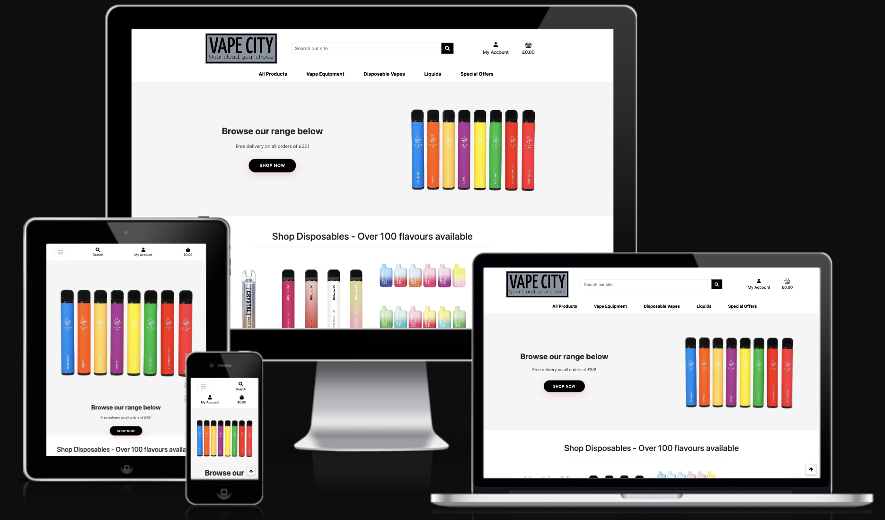

# PP5 - Vape City

Vape City is an e-commerce site that allows users to order vaping products, create accounts to view order history, sign-up to newsletters and contact the store. As an avid vaper I struggle to find vaping e-commerce platforms with good UX that are reliable. This is a problem in the vaping industry as retail vaping products are generally supplied by very small businesses that cannot afford good developers. They also cannot use popular self-build platforms such as Shopify as most ban the setup of vape shops due to the lack of regulation in the vaping space. My goal with this site is to use the skills and knowledge I have learning throughout this course to solve this real-world problem with an e-commerce site that could become a trusted brand with good UX and a reliable store.

[The live project can be viewed here.](https://pp5-vape-city.herokuapp.com/)

# Planning

I started this project by setting up a project in GitHub and using agile methodologies to define user stories that would guide me in the development of site. This allowed me to develop the site in small sprints by focusing on one user story at a time. The goal with using this agile methodology was to prevent me becoming overwhelmed with several developments at once. In the past I have tended to flip between front-end UX and back-end application and get lost or overwhelmed trying to code too many things at once.

Please see my initial GitHub issues:

I finished the majority of my initial issues and also added a couple more. I didn't end up creating functionality for subscribing for regular products or deleting accounts. These are things I would consider for future iterations but they were not in scope for the initial sprints on this project. Please see my finished board:

# Features

## Existing Features

## Future Features

# Business Model

The business model I have chosen for this site is B2C (Business to Customer). 

The marketing approaches I have implemented so far are: 

* Search Engine Optimisation (SEO) with rel tags, meta description, robots.txt file and sitemap.xml.
* Content marketing linked in with SEO by ensuring content is specific and follows keyword research I have done around the most popular vape searches, i.e. disposable vape
* Social Media Marketing with a Facebook page setup for the store (https://www.facebook.com/people/Vape-City/100090646303099/?mibextid=LQQJ4d)
* Email Marketing with a newsletter sign-up in the footer of the site

# Custom Models

# Testing

## Manual Testing

### Test Navigation

### Contact Form Tests

### Registration Form Tests

* Test Registration form submits

* Test empty values in all fields

I tested all fields individually as empty fields and all fields raised an error asking the user to fill in the field.

* Test valid email address

I tested whether the field would allow me to enter an incorrect email. It didn't let me and asked me please enter '@' in an email address.

* Test existing account

I tried to create an account with existing email address and it raised an error telling me a user with that name already exists.

### Login Form Tests

* Test empty values in all fields

* Test valid email address

* Test incorrect password

## CRUD Operation Tests

## Automated Testing

## Remaining Bugs

## Validator Testing

I validated views.py, models.py and forms.py in Code Institute PEP8 Linter (https://pep8ci.herokuapp.com/) and no errors were returned.

# Deployment

I followed the following steps to deploy my app to Heroku (these are based on the lessons from Hello Django walkthrough):

# Technologies Used

I used the following technologies:

* Hardware: MacBook Pro
* GitHub
* GitPod
* Google Chrome, Firefox and Safari web browsers
* Django
* Heroku
* Amazon AWS
* ElephantSQL
* Stripe

# Packages/Libraries used

* asgiref==3.5.2
* boto3==1.26.29
* botocore==1.29.29
* crispy-bootstrap4==2022.1
* dj-database-url==0.5.0
* Django==3.2
* django-allauth==0.41.0
* django-countries==7.2.1
* django-crispy-forms==2.0
* django-storages==1.13.1
* gunicorn==20.1.0
* jmespath==1.0.1
* oauthlib==3.2.2
* Pillow==9.3.0
* psycopg2==2.9.5
* python3-openid==3.2.0
* pytz==2022.6
* requests-oauthlib==1.3.1
* s3transfer==0.6.0
* sqlparse==0.4.3
* stripe==5.2.0

# Credits

* Site adapted and built on Boutique Ado walkthrough project

* Image credits in image alt text

* Code Institute lesson content adapted in some areas.

